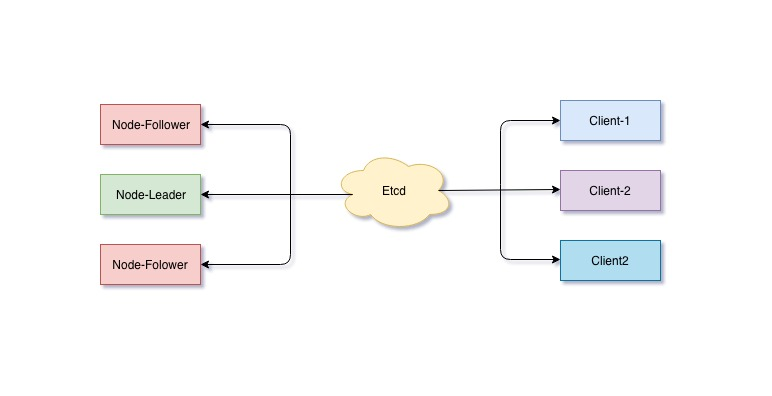
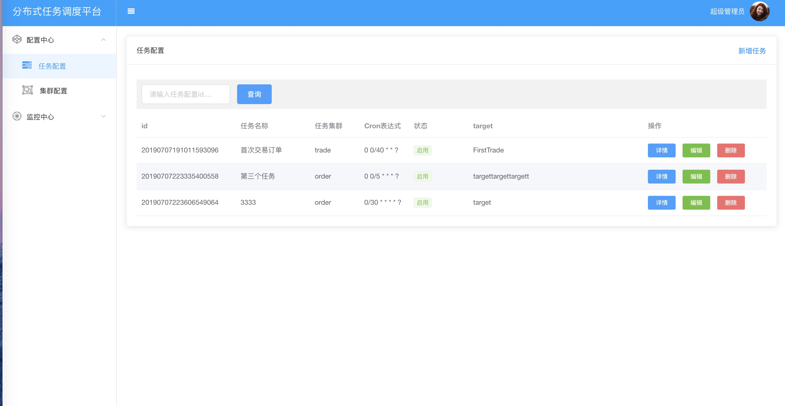
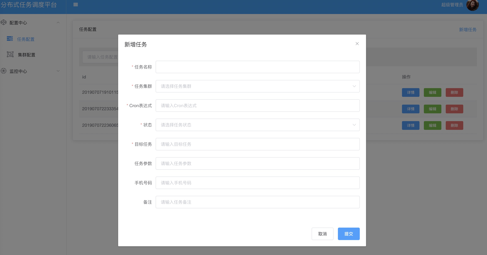
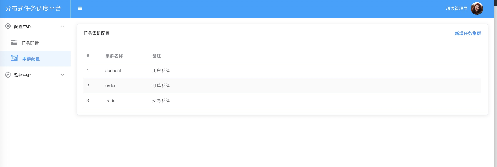
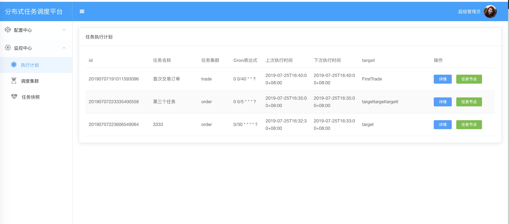
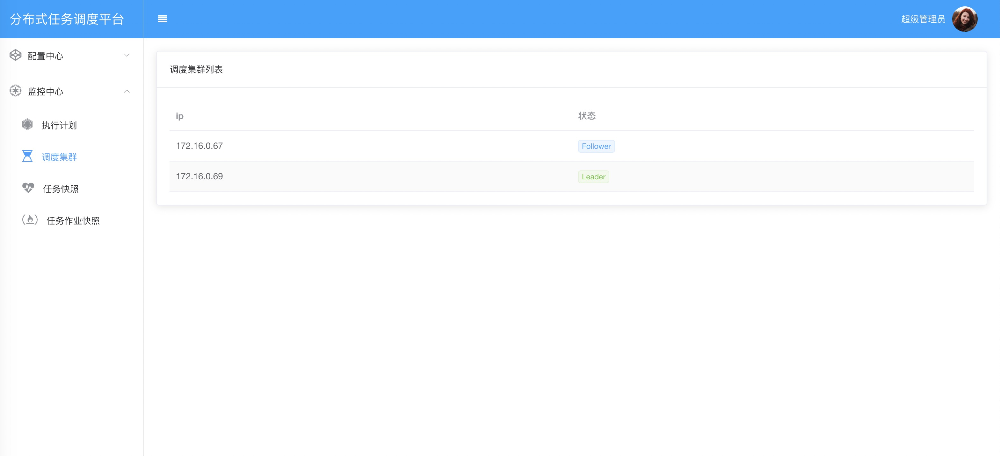
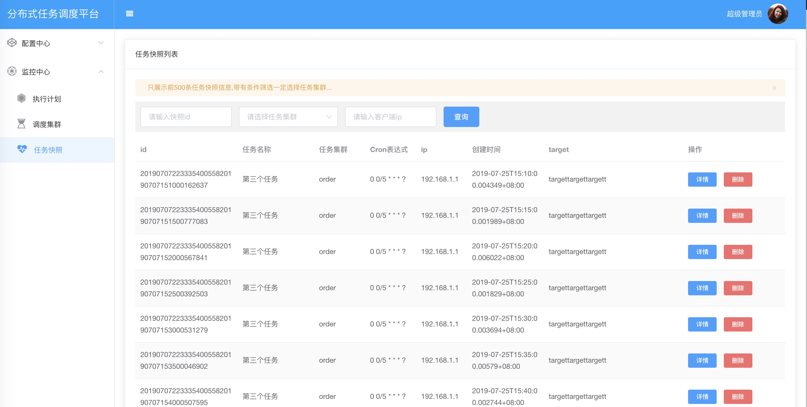
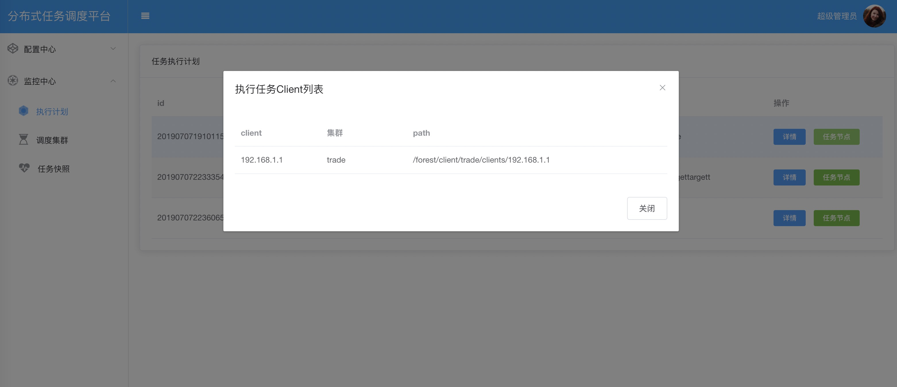
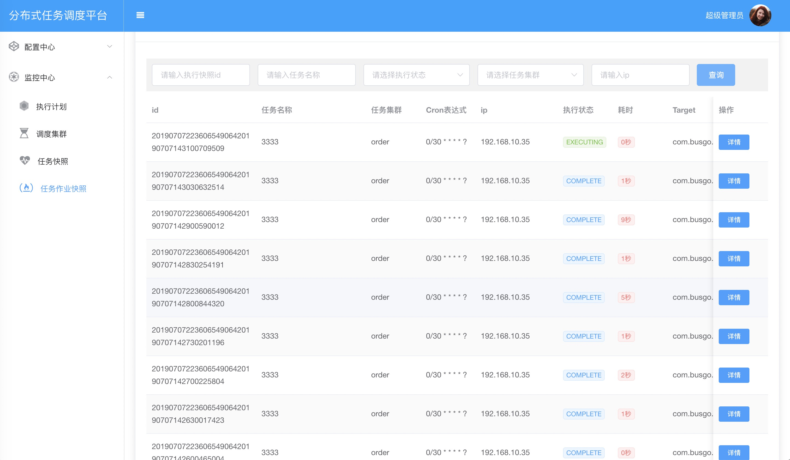

#   分布式任务调度平台

> 演示地址:http://122.51.106.217:6579

## 前言

在企业系统开发过程中难免少不了一些定时任务来进行定时触发执行任务，对于非分布式环境系统中，我们只需要在对应系统中内部集成一些调度库进行配置定时触发即可。
比如：使用Spring框架集成quartz,只需要进行一些简单的配置就能定时执行任务了。但是随着企业的系统越来越多、逐步从单一应用慢慢演变为微服务集群。
在分布式集群系统中主要面临出如：任务的重复执行、没有统一定时任务配置、任务节点故障转移、任务监控&报警等一些列的功能都是要在分布式系统中进行解决。


此分布式的定时任务调度平台，它非常轻量小巧，使用简单，后端以中心服务器为调度核心，负责集群中各种任务的动态分配和调度执行。
在平台前端支持Web界面可视化管理，我们可以创建、暂停/启动任务、删除未执行的任务快照、或者查看任务的调度状态和执行日志。
任务抽象调度任务中心不负责业务任务格式，只负责将任务快照分发到指定的客户端即可。


## 系统架构

可以部署N个Node节点,同一时刻只有一台Leader节点,只有选举成功的Leader节点才有派发任务的权限。任务客户端启动时候通过Etcd进行注册客户端元数据信息。




##  角色

### Job Node Leader 

任务调度集群负责任务的配置管理、监控、任务统计、故障转移以及任务分发工作。整个任务调度集群只有一台 Job Node 是 Leader。

### Job Node Follower 

任务调度集群负责任务的配置管理以及监控，整个任务调度集群可以有 N 台 Job Node 是 Follower。没有故障转移、任务分发能力，当Job Node Leader 不可用下线后触发选举，才有机会成为Leader节点。

### 任务集群(Group)

为了发挥集群的处理业务作业的能力，我们不可能只希望作业集群中的某一台只执行作业。任务集群是将同一个任务或者同一组的任务并发分散到不同的作业机器中。发挥更大的作业能力。

### 任务作业(Client)

任务作业(Client)是每一台作业机器重启后会自动注册至Etcd中方便Job Node Leader 能够将指定的任务分配给自己。自己作业完毕会将结果回传给Etcd指定的目录中以方便Leader进行统计收集工作。


## 选举

由于一个任务调度集群有多台提供服务，我们在可以从集群节点中选举出一台领导节点来进行发号师令，比较成熟的选举算法(Paxos、Raft 等)这里不做讨论。这里使用etcd中的租约机制来实现选举功能。
当一个调度服务节点启动的时候首先尝试发起选举请求(PUT 节点 /forest/server/elect/leader),如果执行成功则选举成功。如果判断已经有其他调度服务节点已经选举成功过则放弃选举请求并进行监听(/forest/server/elect/leader)选举节点变化。如果有领导下线通知则立即发起选举。


在任务调度服务集群中一条任务配置在同一时刻保证只能触发一次任务，如果所有的任务集群都触发了次任务那就说明此任务被重复的执行了N次。我们需要从调度集群中选举出一个调度Leader节点进行指挥。
只有Leader调度节点才能分发任务，其他的Follower节点没有权限分发任务，一旦Leader调度Node挂掉，其他Follower节点则会重新选举，诞生一台新的Leader节点继续指挥服务。

##  平台特点

1.  通过[Web界面管理](https://github.com/busgo/duck)，操作简单方便，支持各种任务
2.  高可用可以部署N台调度集群节点，保证没有单点故障。
3.  部署简单、仅仅需要一个执行文件即可运行。
4.  集成方便，统一任务抽象，接入sdk so easy!
5.  任务故障转移，任务客户端下线自动切至在线客户端任务机器。

## 快速开始


### sql脚本

>   任务作业快照表

```sql
    
    CREATE TABLE `job_execute_snapshot` (
      `id` varchar(64) NOT NULL COMMENT '主键',
      `job_id` varchar(32) NOT NULL COMMENT '任务定义id',
      `name` varchar(32) NOT NULL COMMENT '任务名称',
      `group` varchar(32) NOT NULL COMMENT '任务集群',
      `cron` varchar(32) NOT NULL COMMENT 'cron表达式',
      `target` varchar(255) NOT NULL COMMENT '目标任务',
      `params` varchar(255) DEFAULT NULL COMMENT '参数',
      `ip` varchar(32) NOT NULL COMMENT 'ip',
      `status` tinyint(4) NOT NULL COMMENT '状态 1-执行中 2-完成  3-未知  4-错误',
      `mobile` varchar(32) DEFAULT NULL COMMENT '手机号码',
      `remark` varchar(255) DEFAULT NULL COMMENT '备注',
      `create_time` varchar(32) NOT NULL COMMENT '创建时间',
      `start_time` varchar(255) DEFAULT NULL COMMENT '开始时间',
      `finish_time` varchar(32) DEFAULT NULL COMMENT '结束时间',
      `times` bigint(20) DEFAULT '0' COMMENT '耗时',
      `result` varchar(255) DEFAULT NULL COMMENT '返回结果',
      PRIMARY KEY (`id`),
      KEY `ip` (`ip`),
      KEY `job_id` (`job_id`),
      KEY `status` (`status`),
      KEY `group` (`group`)
    ) ENGINE=InnoDB DEFAULT CHARSET=utf8 COMMENT='任务作业执行快照';


```

###    先决条件
   *    golang(>=1.11)
   *    git 
   
###    源代码安装

```shell
    git clone https://github.com/busgo/forest.git
    cd forest/forest
    go build forest.go
```
####    等待自动下载依赖库

```shell

appledeMacBook-Pro:forest apple$ go build forest.go 
go: finding github.com/xiang90/probing v0.0.0-20190116061207-43a291ad63a2
go: finding github.com/dgrijalva/jwt-go v3.2.0+incompatible
go: finding github.com/golang/groupcache v0.0.0-20190702054246-869f871628b6
go: finding github.com/coreos/pkg v0.0.0-20180928190104-399ea9e2e55f
go: finding github.com/coreos/go-systemd v0.0.0-20190620071333-e64a0ec8b42a
go: finding github.com/prometheus/client_golang v1.0.0
go: finding github.com/coreos/bbolt v1.3.3
go: finding github.com/prometheus/common v0.4.1
go: finding github.com/grpc-ecosystem/go-grpc-middleware v1.0.0
go: finding github.com/coreos/etcd v3.3.13+incompatible
go: finding github.com/tmc/grpc-websocket-proxy v0.0.0-20190109142713-0ad062ec5ee5
go: finding github.com/grpc-ecosystem/grpc-gateway v1.9.4
go: finding github.com/gogo/protobuf v1.1.1
go: finding github.com/alecthomas/template v0.0.0-20160405071501-a0175ee3bccc
go: finding github.com/prometheus/procfs v0.0.0-20181005140218-185b4288413d
go: finding gopkg.in/yaml.v2 v2.2.1
...
```

> 如果下载依赖库出现超时问题,请重复执行编译命令直到成功为止。


####    查看命令行参数

```shell
appledeMacBook-Pro:forest apple$ ./forest  -help
flag needs an argument: -help
Usage of ./forest:
  -db-url string
        db url for mysql (default "root:123456@tcp(127.0.0.1:3306)/forest?charset=utf8")
  -etcd-dailtimeout int
        etcd dailtimeout (default 5)
  -etcd-endpoints string
        etcd endpoints (default "127.0.0.1:2379")
  -help string
        forest help
  -http-address string
        http address (default ":2856")
```

####    启动服务

```shell

nohup etcd  > etcd.log 2>&1 & 
	
nohup forest  > forest.log 2>&1 & 
	
appledeMacBook-Pro:forest apple$ tail -500f forest.log 
{"time":"2019-07-25T15:05:40.041263+08:00","level":"-","prefix":"-","file":"node.go","line":"71","message":"the job node:192.168.10.35, success register to :/forest/server/node/192.168.10.35"}

   ____    __
  / __/___/ /  ___
 / _// __/ _ \/ _ \
/___/\__/_//_/\___/ v3.3.10-dev
High performance, minimalist Go web framework
https://echo.labstack.com
____________________________________O/_______
                                    O\
{"time":"2019-07-25T15:05:40.046041+08:00","level":"INFO","prefix":"-","file":"group.go","line":"92","message":"add a new group:account,for path:/forest/server/group/account"}
{"time":"2019-07-25T15:05:40.046172+08:00","level":"INFO","prefix":"-","file":"group.go","line":"92","message":"add a new group:order,for path:/forest/server/group/order"}
{"time":"2019-07-25T15:05:40.049989+08:00","level":"-","prefix":"-","file":"node.go","line":"210","message":"the job node:192.168.10.35,elect  success to :/forest/server/elect/leader"}
{"time":"2019-07-25T15:05:40.050021+08:00","level":"INFO","prefix":"-","file":"group.go","line":"92","message":"add a new group:trade,for path:/forest/server/group/trade"}
⇨ http server started on [::]:2856

```

####    交叉编译

```shell
  
  # mac os 
  GOOS=darwin GOARCH=amd64 go build forest.go
   
  # linux
  GOOS=linux GOARCH=amd64 go build forest.go
    
  # windows
  GOOS=windows GOARCH=amd64 go build forest.go

```


##    安装web分布式任务调度平台

###    下载源码[duck](https://github.com/busgo/duck)

>   本地必须安装node环境

 
 ```shell
    git clone https://github.com/busgo/duck.git
    cd duck 
    
    修改 request.js 文件中的地址
    
    npm install 
    
    启动服务 
    
     # 开发环境
    npm  run dev
    
    # 生产环境
    npm run-script build
 ```

##  Etcd 元数据目录说明

### 选举目录

>   /forest/server/elect/leader

是一个临时节点，用于任务调度节点选举，选举成功将节点的ip写入

### 调度节点注册目录

>   /forest/server/node/%s

调度集群中的节点将自己的节点ip写入

### 任务集群

>   /forest/server/group/

任务集群信息全放入此目录下

### 任务快照

>   /forest/client/snapshot/%s/%s/%s

分配任务快照信息放入此目录下

such as  /forest/client/snapshot/trade/192.168.1.1/201901011111111323


### 任务客户端信息

>   /forest/client/%s/clients/

所有任务客户端注册此目录下

such as  /forest/client/trade/clients/192.168.1.1


### 任务作业上报目录
>   /forest/client/execute/snapshot/%s/%s/

such as  /forest/client/execute/snapshot/trade/192.168.1.1/201901011111111323


##   管理任务

###  任务配置管理



###  新建任务




### 任务集群



### 任务执行计划



### 调度集群



### 任务快照



### 任务客户端节点



### 任务作业快照




##  Client Libraries 

*   [cat](https://github.com/busgo/cat) for Java sdk
*   [bus](https://github.com/busgo/bus) for Go sdk

##  待完善

1.  ~~任务故障转移~~
2.  ~~任务执行日志收集~~
3.  ~~任务作业sdk~~
4.  ~~手动执行任务~~
5.  ~~任务统计~~
6.  任务报警
7.  ~~任务调度计划同步~~

##  联系方式

如有问题请联系 QQ:466862016    Email:466862016@qq.com 讨论QQ群:806735002

##  License

Forest is under the Apache 2.0 license. See the [LICENSE](LICENSE) file for details.


